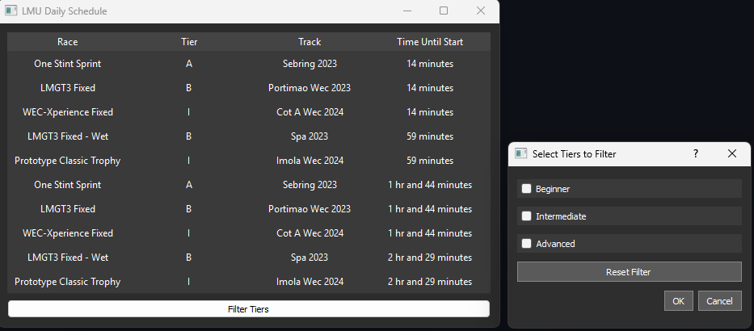

An application to keep track of the LMU daily schedule.

It converts all race times to your local time zone.

You can filter tiers (e.g. Only show Beginner and Advanced)

Made in python by scraping racecontrol.gg with Beautiful Soup and a GUI made with PyQt5

